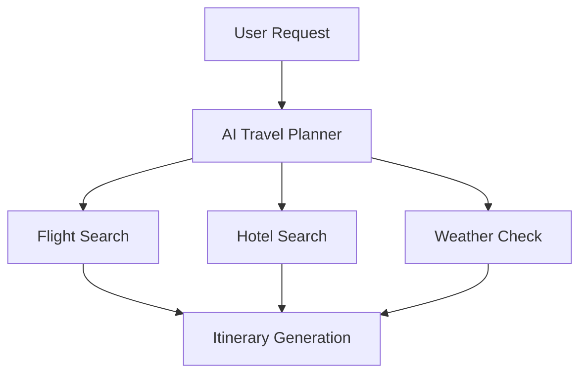

# Examples

This page shows how the MCP server capabilities can be used together for a representative agentic workflow.

## AI Travel Planner

### Overview

The AI Travel Planner is a simulated workflow used to demonstrate how the DeepAgentLabs MCP Server can inspect and test an agentic workflow.

The workflow represents a request to:

> Plan a 3-day trip to Goa.

The example includes simulated steps for:

1. Searching for flights
2. Searching for hotels
3. Checking weather
4. Generating a travel itinerary

> **Note:** This example is a simulated workflow. It does not connect to real flight, hotel, or weather APIs.

---

## Workflow

